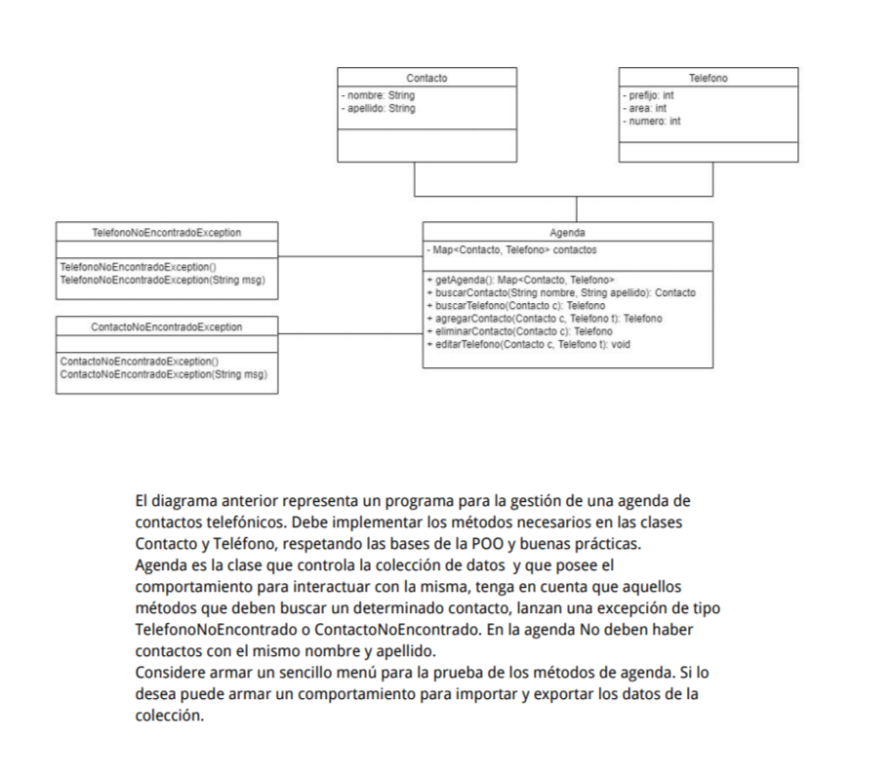

El diagrama anterior representa un programa para la gestión de una agenda de contactos telefónicos. Debe implementar los métodos necesarios en las clases Contacto y teléfono, respetando las bases de la POO y buenas prácticas. 
Agenda es la clase que controla la colección de datos y que posee el comportamineto para interacturar con la misma, tenga en cuenta que aquellos métodos que deben buscar un determinado contacto, lanzan una excepció de tipo TelefonoNoEncontrado o ContactoNoEncontrado. En la agenda No deben haber contactos con el mismo nombre y apellido.
Considere armar un sensillo menú para la prueba de los métodos de agenda. Si lo desea puede armar un comportamineto para importar y exportar los datos de la colleción.